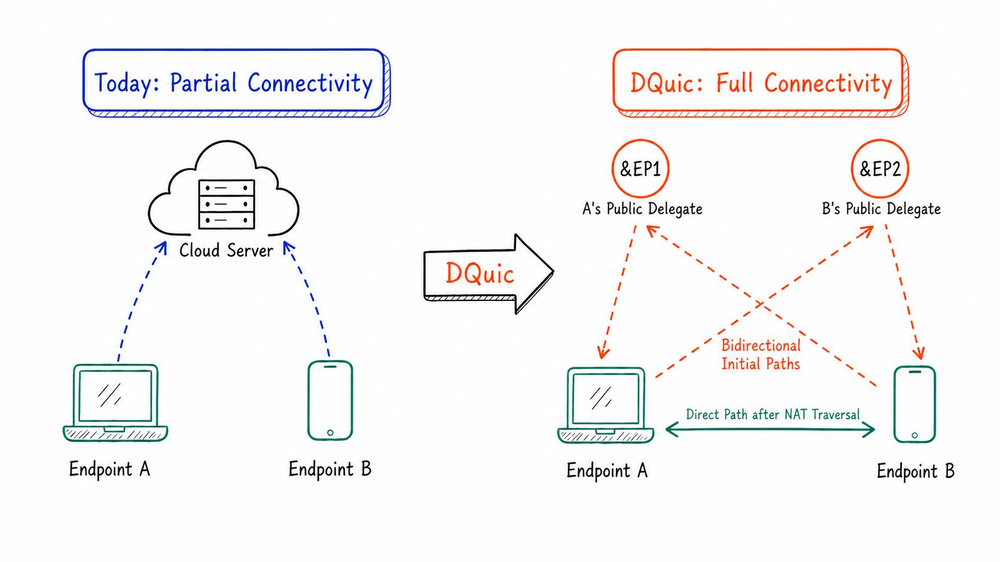

<p align="center">
  <a href="https://github.com/genmeta/dquic" title="DQuic">
    
  </a>
</p>
<h3 align="center">A QUIC implementation extended for peer-to-peer communication and multipath transport</h3>

[](https://www.apache.org/licenses/LICENSE-2.0)
[](https://github.com/genmeta/dquic/actions/workflows/rust.yml)
[](https://codecov.io/gh/genmeta/dquic)
[](https://crates.io/crates/dquic)
[](https://docs.rs/dquic/)
[](https://github.com/genmeta/dquic/network/dependencies)


**English** | [简体中文](README_CN.md)

**Is the Internet really interconnected?** At the data-link layer, many paths exist between any two endpoints; at the transport layer, it is not quite so — not all such paths are traversable, leaving the Internet only partially interconnected.
Reachability is predicated on listening for inbound connections — a capability the architecture has systematically reserved for servers alone.
If two phones cannot open a channel without some server in between, the architecture hardly deserves to be called an "inter" network.

Most clients reside in private networks and have no public IP address on which to listen.
Yet what is rarely noted is that such clients, simply by pairing with a public delegate endpoint, can gain the capability to listen as well.
The result is that the network address is no longer the endpoint's IP address alone: it is a compound endpoint address that contains the private endpoint's publicly mapped address and the address of its public delegate endpoint.

DQuic applies this `ep-&EP` pairing model so that every endpoint can listen.
And, with the help of their &EP, any two endpoints try to establish a peer-to-peer connection, without permanently relying on the &EP's relay.
Public delegate endpoints are not heavy TURN servers such as coturn: rather than relaying traffic indefinitely, they simply forward packets at the IP layer to the intended endpoint in the private network until a direct path is established.
They need not be fixed central servers or clusters that stay online permanently; they can be self-organized and autonomous.
This makes decentralized, transport-layer interconnection possible.
That is the true **"inter"**-net.

<p align="center">
  
</p>

## Endpoint Addresses

In DQuic, accepting connections is no longer a privilege of servers: any endpoint with an Endpoint Address can be the callee.
An Endpoint Address has the following form:

```rust,ignore
pub enum EndpointAddr {
    Direct {
        addr: SocketAddr,
    },
    Mediate {
        agent: SocketAddr,
        outer: SocketAddr,
    },
}
```

> [!NOTE]
>
> An Endpoint Address describes an endpoint's currently reachable network address. A public endpoint uses `EndpointAddr::Direct`, consisting of its IP address and port. A private-network endpoint uses `EndpointAddr::Mediate`, which combines the public delegate endpoint's address with its own publicly mapped address.
> DDns uses E records (Endpoint Address Records) to resolve a name to one or more current `EndpointAddr` values. See the [DDns Protocol Documentation](https://docs.dhttp.net/en/docs/protocol/ddns) and the [open-source DDns implementation](https://github.com/genmeta/ddns).

## Peer-to-Peer Communication

Building on the [Using QUIC to traverse NATs](https://datatracker.ietf.org/doc/html/draft-seemann-quic-nat-traversal-02) draft, DQuic provide full NAT traversal support for its connections.
The draft remains at an early stage: it defines the relevant extension frames but does not fully specify how NAT traversal coordinates with QUIC.
With the `ep-&EP` pairing model, DQuic uses the `Mediate` form of an Endpoint Address to represent the delegate route and integrates STUN, relay, and signaling into the connection workflow to establish peer-to-peer connections between private-network endpoints.

In this model, a private-network endpoint `ep` pairs with at least one public endpoint, denoted `&EP`, serves as `ep`'s public delegate endpoint. The two communicating endpoints first use their respective Endpoint Addresses to establish an initial reachable path, then exchange candidate addresses and try to establish a direct peer-to-peer path.

A validated peer-to-peer path is added to the connection and becomes the preferred transport path. If a direct path cannot be established, the connection can continue over the relayed path through the public delegate endpoint.

> For more information, see the [DQuic Protocol Documentation](https://docs.dhttp.net/en/docs/protocol/dquic).

## Multipath Transport

An endpoint may simultaneously use Wi-Fi, cellular, and Ethernet networks and may have both IPv4 and IPv6 protocol stacks.
Two endpoints can therefore have multiple transport paths between them.
Instead of following the [MP-QUIC draft](https://datatracker.ietf.org/doc/html/draft-ietf-quic-multipath), DQuic implements a hybrid multipath transport scheme.
It relies on independent packet transmission on each path and partial ordering of packet numbers, and schedules packets according to path priority and send-buffer occupancy.

Standard QUIC performs the handshake over a single initial path.
DQuic can instead attempt multiple paths in parallel and complete the handshake over the fastest-responding path, reducing both connection establishment latency and resource consumption.
Each path can subsequently attempt NAT traversal independently, increasing the odds of establishing a peer-to-peer path.
When the network changes, QUIC connection migration allows NAT traversal to be retried over new paths without interrupting the connection.

> [!NOTE]
>
> As network communication infrastructure continues to evolve, IPv6 will become increasingly widespread.
> By then, most endpoints will have a publicly routable IPv6 address of their own, further reducing the already low overhead of NAT traversal to near zero.
> We look forward to broader IPv6 adoption and smoother connectivity.

> For more information, see the [DQuic Protocol Documentation](https://docs.dhttp.net/en/docs/protocol/dquic).

## Openness and Security

You may reasonably worry that exposing private-network devices to the public Internet through EndpointAddr and DQuic is unsafe.
And it is true that exposing a private device's SSH port with a weak password is dangerous.
But DQuic is built on a different security model:
its security comes neither from staying hidden,
nor merely from QUIC's encrypted transport.
Through DQuic, DDns, and DHttp,
every endpoint is given a domain name and a PKI certificate — endpoints authenticate one another with mTLS and cryptographic certainty.

For decades, we have grown accustomed to the sense of security that comes from hiding inside private networks — yet few have noticed what this invisibility costs: an endpoint stripped of the ability to accept incoming connections is condemned to passivity.
That ability matters, because only an endpoint that can both call and answer can interconnect as an equal.
And interconnection does not mean unfettered access: DQuic enforces name-centered mTLS identity verification together with access policies — a mechanism far more robust and secure than traditional IP-address-based firewalls.

**Openness and security are not a trade-off — we can have both.**

> IP addresses do carry identity information, but they are frequently reassigned and can be spoofed.
> By comparison, PKI certificates provide stronger verifiable identity, and certificate forgery is much rarer in practice.

## Quick Start

Add DQuic to your `Cargo.toml`:

```toml
[dependencies]
dquic = "0.7.0-beta.4"
```

For complete usage instructions and runnable examples, see:

- [DQuic Protocol Documentation](https://docs.dhttp.net/en/docs/protocol/dquic)
- [Client and Server examples](dquic/examples)
- [HTTP/3 examples](h3-shim/examples)

## Contributing

Contributions and discussions around DQuic usage and improvement are welcome. Use [GitHub Issues](https://github.com/genmeta/dquic/issues) to share ideas, suggest improvements, or report problems. If you have implemented an improvement, pull requests are welcome. Before contributing code, read [CONTRIBUTING.md](CONTRIBUTING.md) and [CODE_OF_CONDUCT.md](CODE_OF_CONDUCT.md). Report security issues by following the process in [SECURITY.md](SECURITY.md).
