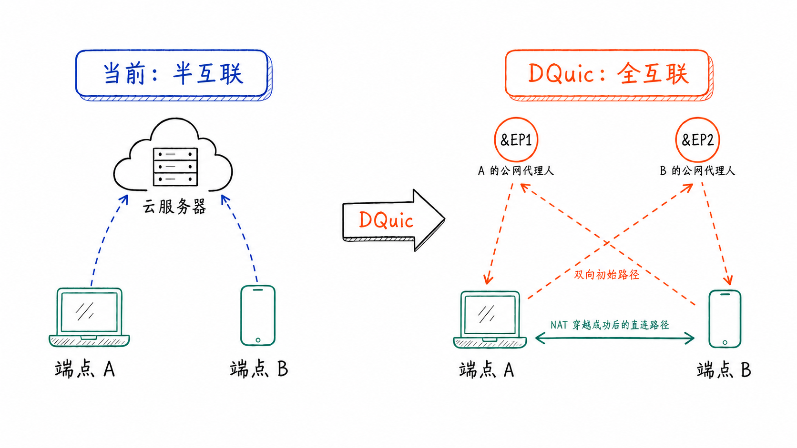

<p align="center">
  <a href="https://github.com/genmeta/dquic" title="DQuic">
    
  </a>
</p>
<h3 align="center">支持点到点通信和多路径传输的 QUIC 扩展实现。</h3>

[](https://www.apache.org/licenses/LICENSE-2.0)
[](https://github.com/genmeta/dquic/actions/workflows/rust.yml)
[](https://codecov.io/gh/genmeta/dquic)
[](https://crates.io/crates/dquic)
[](https://docs.rs/dquic/)
[](https://github.com/genmeta/dquic/network/dependencies)


[English](README.md) | **简体中文**

**互联网真的“互联“吗？** 从数据链路层面上看是互联的，从连接层面上看却是部分互联的；能被连接意味着在进行网络监听，而网络监听却只是服务端的特权。所以你几乎没见过手机之间直接互联，客户端之间的互联实际上只能依赖的服务端的帮助。

**为什么？** 因为客户端大部分生活在私有网络中，本身没有公共 IP 地址来进行网络监听。不过，注意到，只要给私网端点配一个公网搭档，让其代为中转收包，就能让私网节点也拥有了网络监听的能力。所付出的代价不过是收包地址不再是简单的“私网端点的 IP 地址“，而是附加了“通过 xx 搭档节点转递给 xx 私网端点“的的复合地址而已。

DQuic 正是利用了上述让私网端点和公网搭档配对的思路，使普通端点也能进行网络监听并建立对等连接。注意公网搭档所做的不是复杂的 coturn 服务器，就仅仅是按新的“地址指示“转发给目标私网端点而已，**公网搭档不必是固定部署的基础设施，也不必是长期在线的中心服务器**，这使得在连接层达成去中心化的完全互联成为可能，这才是**真正的互联网**。

<p align="center">
  
</p>

## Endpoint 地址

在 DQuic 中，**连接的对端不再局限于服务端**，任何拥有新型 Endpoint 地址的端点皆可对等地互联。Endpoint 地址结构如下：

```Rust
pub enum EndpointAddr {
    Direct {
        addr: SocketAddr,
    },
    Agent {
        agent: SocketAddr,
        outer: SocketAddr,
    },
}
```

> [!NOTE]
>
> EndpointAddr 描述一个端点的网络可达地址：公网端点使用 EndpointAddr::Direct 形式的地址，即 IP 地址和端口；私网端点则使用 EndpointAddr::Agent 形式的地址，由公网搭档的可达地址和私网端点自身的公网映射地址组成。DDns 使用 E 记录（EndpointAddress Record）将名字解析到端点当前的一个或多个 EndpointAddr。详见 [DDns 协议文档](https://docs.dhttp.net/zh/docs/protocol/ddns) 和 [DDns 开源实现](https://github.com/genmeta/ddns)。

## 点到点通信

DQuic 在 [Using QUIC to traverse NATs](https://datatracker.ietf.org/doc/html/draft-seemann-quic-nat-traversal-02) 草案的基础上，实现了完整的 NAT 穿越能力。尽管该草案仍处于早期阶段，只定义了相关扩展帧，没有完整说明 NAT 穿越过程如何与 QUIC 协同工作；DQuic 借助上述新引入的 `ep-&EP` 搭档模型，将 STUN、TURN、Signaling 融入 Endpoint 地址中的 Agent 端点，成功地完成了私网端点之间的 P2P 建连过程。

在该模型中，私网端点 `ep` 与至少一个公网端点 `EP` 配对搭档，由 `&EP` 作为 `ep` 的公网搭档。两个通信端点首先利用各自的 EndpointAddr 中的公网搭档中转数据包建立初始路径，随后交换各自的候选地址，并据此建立 P2P 路径。

验证成功的 P2P 路径会加入当前连接成为主要传输通道；无法直连时，连接仍可使用公网搭档的中转路径。

> 更多介绍，请参见 [DQuic 协议文档](https://docs.dhttp.net/zh/docs/protocol/dquic)。

## 多路径传输

一个端点往往同时接入 Wi-Fi、蜂窝网和以太网多种网络，并且拥有 IPv4/IPv6 双网络协议栈，因此两个端点之间存在多条传输路径。DQuic 未按照 mpquic 草案来设计多路径传输，而是靠每条路径发包的独立性和所发数据包序号的偏序性，实现了一种按路径优先级和发送缓冲区趋势调度的多路径混合传输方案。

标准 QUIC 局限于在单条路径上完成握手；DQuic 连接握手则可以并行尝试多条路径，选择最快响应的路径完成握手，从而提高建连速度和成功率。之后的每条路径都会独立地尝试 NAT 穿越，这又会增加整条连接 NAT 穿越成功的可能性。即便网络发生变化，借助 QUIC 的连接迁移方案，通信也可以无缝地在新路径上重新尝试 NAT 穿越，不影响连接整体的稳定性。

随着 IPv6 普及，当双方能够直接通过 IPv6 通信时，DQuic 将直接使用 IPv6 路径，无需 NAT 穿越。

> 更多介绍，请参见 [DQuic 协议文档](https://docs.dhttp.net/zh/docs/protocol/dquic)。

## 开放互联与安全性

您可能会担心，私网设备靠 EndpointAddr 和 DQuic 暴露到公网上十分危险。通过 VPN 等方案暴露私网设备 SSH 端口到公网上且设置简单密码的确如此，不过 DQuic 无需担心，这不是因为 DQuic 本身无需 VPN 权限，也不只是因为 QUIC 传输协议本身非常安全，还因为 DQuic、DDns、DHttp 三个协议将域名和 PKI 机制下的证书赋给了每一个端点，端点之间不会使用弱密码口令，而是使用 mTLS 验证双方身份，十分安全！

一方面，私网设备确实要先暴露到公网上才能开放互联，但暴露到公网不代表就是不安全；另一方面，它也需要一套防火墙机制。开放互联也不是指互相随意访问，只有获得授权的身份来访问才被允许：DQuic 互联之后，以“名字“为中心的 mTLS 身份验证和访问策略机制，要比基于 IP 地址的传统防火墙强大的多，也安全的多。

> IP 地址虽然包含有一定的身份信息，但 IP 地址充满变数，地址欺诈仍然时有发生；相比较而言，基于 PKI 机制下的证书欺诈则很少发生。

## 快速开始

在 `Cargo.toml` 中添加 DQuic：

```toml
[dependencies]
dquic = "0.7.0-beta.4"
```

完整用法和可运行示例：

- [DQuic 使用文档](https://docs.dhttp.net/zh/docs/protocol/dquic)
- [客户端、服务端与 Stream 示例](dquic/examples)
- [HTTP/3 示例](h3-shim/examples)

## 参与贡献

欢迎围绕 DQuic 的使用和改进交流讨论。你可以通过 [GitHub Issues](https://github.com/genmeta/dquic/issues) 分享想法、提出建议或反馈问题；如果已经实现相应改进，也欢迎提交 Pull Request。贡献代码前请阅读 [CONTRIBUTING.md](CONTRIBUTING.md) 和 [CODE_OF_CONDUCT.md](CODE_OF_CONDUCT.md)，安全问题请按照 [SECURITY.md](SECURITY.md) 中的流程报告。
